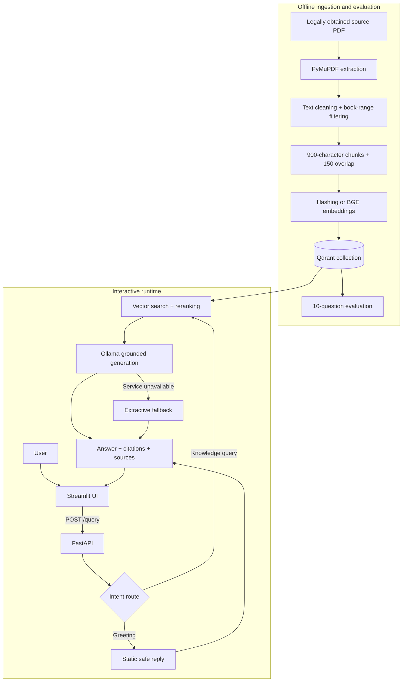

# Wizarding Library RAG — Complete Technical Guide

This document explains what the project does, why it is designed this way, how every major component works, and how to reproduce, test, evaluate, operate, and extend it. It is the final project for the **ITI Applied AI Course** and is organized as a portfolio-quality software system rather than a notebook-only prototype.

## 1. Executive summary

Wizarding Library RAG is a grounded question-answering system over a seven-book PDF corpus. A user asks a question in a Streamlit chat interface. FastAPI validates and routes the request, the retrieval layer searches a persisted Qdrant collection, and a local Ollama model receives only the strongest source excerpts. The response includes book and page citations. When the model service is unavailable, a deterministic extractive fallback keeps the system useful without inventing information.

The project demonstrates these applied-AI capabilities:

- extracting and cleaning a large PDF corpus;
- chunking text while preserving book and page metadata;
- creating deterministic offline or optional semantic embeddings;
- storing and searching vectors in Qdrant;
- reranking retrieval candidates with question-aware signals;
- constraining an LLM to retrieved evidence and explicit citations;
- exposing the pipeline through a typed, documented API;
- building a usable chat interface with failure and loading states;
- evaluating retrieval separately from answer generation;
- testing, linting, containerizing, and continuously integrating the system.

## 2. System architecture



The ingestion path runs only when building or rebuilding the index. The runtime path reuses the persisted vectors, so requests do not repeatedly parse the PDF or recompute the full corpus.

## 3. Repository map

| Path | Responsibility |
|---|---|
| `notebooks/rag_pipeline.ipynb` | Executed experiment covering extraction, indexing, retrieval, and evaluation |
| `notebooks/evaluation_results.csv` | Auditable per-question evaluation output |
| `scripts/build_index.py` | Reproducible command-line index builder |
| `backend/app/core/config.py` | Typed environment configuration and safe path resolution |
| `backend/app/services/documents.py` | Book ranges, PDF cleanup, chunking, IDs, and metadata |
| `backend/app/services/embeddings.py` | Offline hashing and optional Sentence Transformers adapters |
| `backend/app/services/retrieval.py` | Qdrant connection, vector search, thresholding, and reranking |
| `backend/app/services/generation.py` | Grounded Ollama prompt and deterministic fallback |
| `backend/app/services/pipeline.py` | Intent routing and orchestration |
| `backend/app/api/routes/query.py` | Health and query HTTP endpoints |
| `backend/app/schemas/query.py` | Pydantic request and response contracts |
| `backend/app/main.py` | FastAPI application, CORS, lifespan, and resource cleanup |
| `frontend/app.py` | Streamlit chat experience and source rendering |
| `frontend/api_client.py` | Isolated, configurable backend client |
| `backend/tests/` | Unit and API behavior tests |
| `.github/workflows/ci.yml` | Automated lint, test, and compilation checks |
| `docker-compose.yml` | Multi-service local deployment |

## 4. Data ingestion, step by step

### 4.1 Page selection

The source is a 3,623-page compilation. `BOOK_RANGES` maps valid PDF pages to the seven book titles. Front matter, separator pages, and unrelated trailing material are skipped. This prevents decorative or index content from polluting retrieval.

### 4.2 Text extraction and cleanup

PyMuPDF reads the embedded page text; OCR is unnecessary for this corpus. Cleanup removes soft hyphens and null characters, rejoins words broken by line-end hyphenation, collapses repeated whitespace, and trims the result.

### 4.3 Chunking

Each page is divided into approximately 900-character chunks with 150 characters of overlap. The splitter prefers whitespace boundaries in the latter half of a chunk. Overlap preserves context when an answer crosses a boundary, while page-local processing keeps citations precise.

Every chunk contains:

```text
chunk_id, document, book_name, page_number, content
```

The ID is a stable SHA-1-derived identifier built from the filename, page, chunk ordinal, and content prefix. Stable IDs make rebuilds reproducible and avoid accidental duplicates.

### 4.4 Embedding choices

The default `hashing` backend uses scikit-learn's stateless `HashingVectorizer` with lowercase word unigrams and bigrams, English stop-word removal, L2 normalization, and 768 dimensions. It works offline, downloads no model, and produces repeatable vectors—useful for evaluation and CI.

The optional `sentence-transformers` backend uses `BAAI/bge-small-en-v1.5` by default. It provides stronger semantic matching but requires a model download and more compute. Install `requirements-semantic.txt` before selecting it.

The backend used for querying must match the backend and dimensions used to create the collection. Changing either requires an index rebuild.

### 4.5 Qdrant indexing

The builder creates a cosine-distance Qdrant collection and uploads vectors with their complete payload. Qdrant can run in embedded persisted mode at `backend/data/vector_store`, through a server URL, or in Qdrant Cloud. The local store and copyrighted PDF are intentionally excluded from Git.

Run ingestion with:

```powershell
conda activate rag
python scripts/build_index.py
```

For semantic embeddings:

```powershell
pip install -r requirements-semantic.txt
python scripts/build_index.py --backend sentence-transformers
```

## 5. Query lifecycle, step by step

1. Streamlit sends the question and selected `top_k` value to `POST /query`.
2. Pydantic rejects invalid input before it reaches the pipeline.
3. The lightweight router recognizes simple greetings; all knowledge questions enter retrieval.
4. The same embedding backend used for indexing encodes the question.
5. Qdrant returns up to `min(50, top_k × 10)` candidates by cosine similarity.
6. A question-aware bonus promotes definition-like passages for questions beginning with “what is,” “what are,” “who is,” or “who was.”
7. Candidates below `MIN_RELEVANCE_SCORE` are removed unless a definition signal provides evidence.
8. The best `top_k` chunks become the only context sent to the generator.
9. Ollama runs at temperature zero with a strict prompt requiring page citations and an explicit abstention when evidence is insufficient.
10. If Ollama cannot be reached and fallback is enabled, the service ranks source sentences by question-term overlap and definition cues, returning up to two cited evidence sentences.
11. The API returns the answer plus structured source metadata; Streamlit renders both.

This design keeps the retriever, generator, API, and UI independently replaceable and testable.

## 6. API behavior

### `GET /`

Returns the service name and discovery links.

### `GET /health`

Reports `ok` when the pipeline and vector collection loaded, otherwise `degraded`. It also reports the collection and configured generation model.

### `POST /query`

Request:

```json
{
  "question": "What is a Horcrux?",
  "top_k": 4
}
```

Response:

```json
{
  "question": "What is a Horcrux?",
  "route": "retrieve",
  "answer": "A grounded answer with [Book title, p. N].",
  "sources": [
    {
      "document": "Harry Potter and the Half-Blood Prince",
      "page": 2710,
      "chunk_id": "stable-id",
      "score": 0.3123,
      "excerpt": "Retrieved evidence preview..."
    }
  ]
}
```

Invalid questions return HTTP `422`. A missing index returns a clear HTTP `503`; unexpected downstream failures are converted to a non-sensitive HTTP `502` response.

## 7. Streamlit experience

The frontend is intentionally thin: it delegates AI work to the API. It provides a chat transcript, configurable source count, backend health check, loading feedback, readable error states, and source cards containing book, page, similarity score, and excerpt. `API_BASE_URL` makes the same UI usable locally or in containers.

## 8. Configuration

Copy `.env.example` to `.env`. Secrets and local settings must never be committed.

| Variable | Default | Meaning |
|---|---|---|
| `APP_ENV` | `development` | Runtime environment label |
| `LOG_LEVEL` | `INFO` | Application logging level |
| `QDRANT_PATH` | `backend/data/vector_store` | Embedded Qdrant directory |
| `QDRANT_URL` | empty | Server/cloud URL; overrides local path |
| `QDRANT_API_KEY` | empty | Optional Qdrant credential |
| `QDRANT_COLLECTION` | `harry_potter_books` | Collection name |
| `EMBEDDING_BACKEND` | `hashing` | `hashing` or `sentence-transformers` |
| `HASHING_DIMENSIONS` | `768` | Hashing vector width |
| `EMBEDDING_MODEL` | `BAAI/bge-small-en-v1.5` | Optional semantic model |
| `TOP_K` | `4` | Default evidence count |
| `MIN_RELEVANCE_SCORE` | `0.25` | Base similarity cutoff |
| `OLLAMA_BASE_URL` | `http://localhost:11434` | Ollama service URL |
| `OLLAMA_MODEL` | `llama3.2:3b` | Generation model |
| `ALLOW_EXTRACTIVE_FALLBACK` | `true` | Use evidence extraction if Ollama fails |
| `FRONTEND_ORIGINS` | local Streamlit URLs | CORS allowlist |
| `API_BASE_URL` | `http://localhost:8000` | Frontend API target |

## 9. Complete local setup

Prerequisites are Git, Conda, and optionally Ollama for generative answers.

```powershell
git clone https://github.com/ZiyadAzzaz/wizarding-library-rag.git
cd wizarding-library-rag
conda env create -f environment.yml
conda activate rag
Copy-Item .env.example .env
```

Place a legally obtained `harrypotter.pdf` one directory above the repository, or pass an explicit source path supported by the build script. Build the collection, then optionally download the configured local model:

```powershell
python scripts/build_index.py
ollama pull llama3.2:3b
```

Start the API:

```powershell
cd backend
uvicorn app.main:app --reload --port 8000
```

In another terminal, start the UI:

```powershell
conda activate rag
cd frontend
streamlit run app.py
```

Visit `http://localhost:8501` for the UI and `http://localhost:8000/docs` for Swagger UI.

## 10. Evaluation methodology and results

The executed notebook evaluates ten representative questions about characters, objects, places, and events. Each row records retrieved sources, top score, expected-term hit, citation grounding, and manually reviewed correctness. Separating these signals matters: a retriever can find relevant text while an answer remains incomplete, and a cited response can still cite insufficient evidence.

Measured offline baseline:

- retrieval term hit: **7/10**;
- answer citation grounding: **10/10**;
- manually reviewed full correctness: **4/10**.

These are deliberately reported as baseline results, not inflated claims. The principal failure modes are high-frequency name matches without answer-bearing context and extraction of related sentences that do not complete multi-part answers. Semantic BGE embeddings, cross-encoder reranking, and Ollama synthesis are the clearest next improvements.

## 11. Testing and continuous integration

Run the same checks used by GitHub Actions:

```powershell
pytest -p no:cacheprovider
ruff check backend frontend scripts
python -m compileall -q backend frontend scripts
```

Tests use dependency overrides and small fixtures, so CI does not need the copyrighted corpus, the full Qdrant index, a model download, or an Ollama process. This keeps feedback fast and reproducible while the executed notebook preserves experimental evidence.

The test suite covers text cleaning and chunking, deterministic embedding behavior, grounded fallback generation, greeting routing, valid queries, request validation, and degraded service behavior.

## 12. Docker workflow

After creating `.env`:

```bash
docker compose up --build
docker compose exec ollama ollama pull llama3.2:3b
```

The index must exist before knowledge queries can succeed. Use the command-line builder with a compatible Qdrant target. The Conda workflow remains the simplest path for a local demonstration with the embedded store.

## 13. Reliability, privacy, and safety decisions

- The source corpus and generated vector store are ignored because they are large, derived, and potentially copyrighted.
- `.env`, credentials, caches, and logs are excluded from version control.
- Local Ollama generation keeps prompts and retrieved passages on the machine by default.
- CORS is allowlisted instead of universally open.
- User input is typed and length-constrained by Pydantic.
- API errors do not expose exception internals.
- The generator is instructed to use only supplied evidence, cite every claim, and abstain when evidence is insufficient.
- The fallback is extractive and source-linked, so loss of the LLM service does not silently produce unsupported answers.

## 14. Troubleshooting

### Health is degraded or queries return `503`

Run `python scripts/build_index.py`, confirm `QDRANT_PATH` or `QDRANT_URL`, and verify that `QDRANT_COLLECTION` matches the built collection.

### Qdrant reports a vector-size mismatch

The index and API are using different embedding settings. Restore the original backend/dimensions or rebuild the collection with the desired backend.

### Ollama connection fails

Start Ollama and pull the configured model. With `ALLOW_EXTRACTIVE_FALLBACK=true`, answers remain grounded but are less fluent and may be incomplete.

### The frontend cannot reach FastAPI

Open `http://localhost:8000/health`, verify `API_BASE_URL`, and ensure the frontend URL is included in `FRONTEND_ORIGINS`.

### Semantic backend import or download fails

Install `requirements-semantic.txt` and ensure Hugging Face model access is available. The hashing backend remains a fully offline fallback.

## 15. Engineering roadmap

1. Replace lexical baseline retrieval with BGE embeddings for stronger semantic recall.
2. Add a cross-encoder reranker and tune thresholds on a larger labeled evaluation set.
3. Add conversation-aware query rewriting without allowing chat history to become evidence.
4. Add answer-level faithfulness and citation-precision metrics.
5. Add authenticated remote deployment with managed Qdrant and secret storage.
6. Add telemetry for latency, retrieval scores, abstentions, and model availability.
7. Add answer-state and API documentation screenshots plus a short demonstration video to the repository assets.

## 16. What this project demonstrates to reviewers

This repository shows more than a working RAG demo. It makes data provenance visible, keeps indexing reproducible, separates experimental and production concerns, acknowledges baseline limitations, handles unavailable dependencies gracefully, protects local data, provides typed service boundaries, and verifies changes automatically. Those choices make the project understandable and maintainable for another engineer—not only runnable on its author's machine.

## License and corpus notice

The project code is available under the [MIT License](LICENSE). The source books are not distributed by this repository and remain subject to their respective copyright. Users must supply a legally obtained source document.
