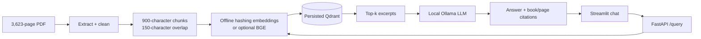

# Wizarding Library RAG

[](https://github.com/ZiyadAzzaz/wizarding-library-rag/actions/workflows/ci.yml)
[](https://www.python.org/)
[](LICENSE)

A production-structured Retrieval-Augmented Generation assistant that answers questions from the seven Harry Potter books and cites the exact retrieved pages. The project implements the **Core Track** in `Graduation_Project_L2.pdf`: reproducible ingestion and evaluation, a persisted Qdrant vector database, a FastAPI backend, a Streamlit frontend, tests, Docker support, and local generation through Ollama.

## What makes the answer grounded?



The LLM receives only the retrieved excerpts and is explicitly required to answer with `[Book title, p. N]` citations. If Ollama is offline, a deterministic extractive fallback returns the strongest evidence sentences with the same citations. If retrieval does not provide enough evidence, it returns: `I do not know based on the retrieved pages.`

## Tech stack

| Layer | Technology |
|---|---|
| Parsing | PyMuPDF |
| Embeddings | Offline deterministic hashing (default); Sentence Transformers/BGE optional |
| Vector database | Qdrant (local persisted mode or Qdrant server/cloud) |
| Generation | Ollama, `llama3.2:3b` by default |
| API | FastAPI + Pydantic |
| UI | Streamlit |
| Quality | pytest, Ruff, Docker Compose |

## Project structure

```text
new_rag_project/
├── notebooks/rag_pipeline.ipynb     # data preparation, retrieval, 10-case evaluation
├── scripts/build_index.py            # reproducible CLI index builder
├── backend/
│   ├── app/
│   │   ├── api/routes/query.py
│   │   ├── core/config.py
│   │   ├── schemas/query.py
│   │   ├── services/{documents,retrieval,generation,pipeline}.py
│   │   └── main.py
│   ├── data/vector_store/            # persisted Qdrant output
│   ├── tests/
│   ├── .env.example
│   └── Dockerfile
├── frontend/{app.py,api_client.py}
├── environment.yml
└── docker-compose.yml
```

## Data

The corpus is the supplied `harrypotter.pdf`, a 17 MB, 3,623-page text-extractable compilation of the seven books. The notebook ignores front matter, separator pages, and the final non-book page using documented book ranges. OCR is not required. The raw copyrighted corpus and generated vector store are excluded from Git; place the PDF one directory above this project, as in the provided training folder.

## Quick start (Windows / Conda)

Prerequisites: Conda, Git, and [Ollama](https://ollama.com/).

```powershell
cd "E:\Azzaz CAI\ITI-Training\RAG\new_rag_project"
conda env create -f environment.yml
conda activate rag
Copy-Item .env.example .env
ollama pull llama3.2:3b
```

Build the vector database once. The default offline hashing backend needs no model download and is fully reproducible:

```powershell
python scripts/build_index.py
```

Start the backend and frontend in separate terminals:

```powershell
conda activate rag
cd backend
uvicorn app.main:app --reload --port 8000
```

```powershell
conda activate rag
cd frontend
streamlit run app.py
```

Open `http://localhost:8501`; interactive API docs are at `http://localhost:8000/docs`.

## Environment variables

| Variable | Default | Purpose |
|---|---|---|
| `QDRANT_PATH` | `backend/data/vector_store` | Local persisted store |
| `QDRANT_URL` | empty | Qdrant server/cloud URL; overrides local path |
| `QDRANT_API_KEY` | empty | Qdrant Cloud credential |
| `QDRANT_COLLECTION` | `harry_potter_books` | Collection loaded at startup |
| `EMBEDDING_BACKEND` | `hashing` | Offline `hashing` or semantic `sentence-transformers` |
| `HASHING_DIMENSIONS` | `768` | Offline vector dimensions; must match index |
| `EMBEDDING_MODEL` | `BAAI/bge-small-en-v1.5` | Model used by the optional semantic backend |
| `TOP_K` | `4` | Default retrieved excerpts |
| `MIN_RELEVANCE_SCORE` | `0.25` | Retrieval cutoff |
| `OLLAMA_BASE_URL` | `http://localhost:11434` | Local Ollama endpoint |
| `OLLAMA_MODEL` | `llama3.2:3b` | Local generation model |
| `ALLOW_EXTRACTIVE_FALLBACK` | `true` | Keep grounded QA available if Ollama is offline |
| `FRONTEND_ORIGINS` | localhost ports | Comma-separated CORS allowlist |
| `API_BASE_URL` | `http://localhost:8000` | Frontend-to-backend URL |

Never commit `.env` or API keys.

## API reference

`GET /health` reports whether the persisted collection loaded. `POST /query` accepts a question and optional retrieval limit:

```bash
curl -X POST http://localhost:8000/query \
  -H "Content-Type: application/json" \
  -d '{"question":"What is a Horcrux?","top_k":4}'
```

Response shape:

```json
{
  "question": "What is a Horcrux?",
  "route": "retrieve",
  "answer": "... [Harry Potter and the Half-Blood Prince, p. 2710]",
  "sources": [{"document": "...", "page": 2710, "chunk_id": "...", "score": 0.83, "excerpt": "..."}]
}
```

Blank/short questions return `422`; unavailable vector or LLM services return a clear `503` or `502` response without leaking internal errors.

## Evaluation

The executed notebook contains 10 representative questions spanning characters, objects, places, and events. It records retrieved sources, top score, keyword relevance, answer grounding, and manually reviewed correctness in `notebooks/evaluation_results.csv`. The evaluation intentionally separates retrieval quality from generation quality so failure cases are diagnosable.

| Question | Top score | Term hit | Grounded | Correct |
|---|---:|:---:|:---:|:---:|
| Flying-car rescue | 0.3780 | Yes | Yes | No |
| Horcrux definition | 0.3123 | Yes | Yes | Yes |
| Sirius Black's relationship | 0.4618 | No | Yes | No |
| Triwizard Tournament | 0.3928 | Yes | Yes | Yes |
| Platform 9¾ entrance | 0.3468 | Yes | Yes | Yes |
| Aragog's creature type | 0.2533 | No | Yes | No |
| Half-Blood Prince identity | 0.4339 | Yes | Yes | No |
| Marauder's Map function | 0.2801 | No | Yes | No |
| Parseltongue explanation | 0.4357 | Yes | Yes | Yes |
| Deathly Hallows list | 0.3007 | Yes | Yes | No |

Measured results: **7/10 retrieval term-hit, 10/10 citation grounding, and 4/10 fully correct answers** using the offline extractive fallback. This is an honest baseline; local Ollama generation and semantic BGE embeddings are expected to improve synthesis and recall once those external model services are installed.

Typical mitigations included in this implementation:

- overlapping chunks prevent answers from being split at page boundaries;
- a similarity threshold reduces irrelevant context;
- deterministic temperature and a strict evidence-only prompt reduce hallucination;
- page/book payloads flow from parsing through Qdrant to the final response;
- missing evidence produces an explicit abstention instead of a guessed answer.

The main observed failures were high-frequency name matches that were not answer-bearing and extractive answers that found related evidence without completing a multi-part answer. Question-aware definition reranking already improved the Horcrux case. Recommended next improvements are BGE semantic embeddings, cross-encoder reranking, and the configured Ollama generator.

## Test and quality checks

```powershell
pytest
ruff check backend frontend scripts
python -m compileall -q backend frontend scripts
```

The API tests use dependency overrides, so they run without downloading a model, starting Ollama, or building Qdrant. The end-to-end demo additionally requires the built index and a running Ollama model.

For stronger semantic retrieval when Hugging Face access is available, install the optional backend and rebuild the index. The backend and index must always use the same embedding backend.

```powershell
pip install -r requirements-semantic.txt
python scripts/build_index.py --backend sentence-transformers
```

Then set `EMBEDDING_BACKEND=sentence-transformers` in `.env`.

## Docker option

Copy `.env.example` to `.env`, then run:

```bash
docker compose up --build
docker compose exec ollama ollama pull llama3.2:3b
```

Build/upload the collection before querying. For the graduation demo, the Conda/local-persisted path is simpler and is the primary documented workflow.

## Submission checklist

- [x] Professional FastAPI structure with startup loading, CORS, validation, logging, and docs
- [x] Streamlit chat UI with loading/error states and configurable backend URL
- [x] Qdrant indexing script and notebook owned by this project
- [x] Ten-question evaluation design
- [x] Happy-path and invalid-input API tests plus chunking tests
- [x] `.env.example`, pinned dependencies, Dockerfiles, and `.gitignore`
- [x] Run the full notebook to create the persisted store and measured evaluation table
- [ ] Capture UI/API screenshots and recorded demo
- [x] Publish to a public GitHub repository

## License and data notice

The project code is released under the [MIT License](LICENSE). The Harry Potter corpus is not distributed by this repository and remains subject to its respective copyright. Users must provide their own legally obtained source document.
